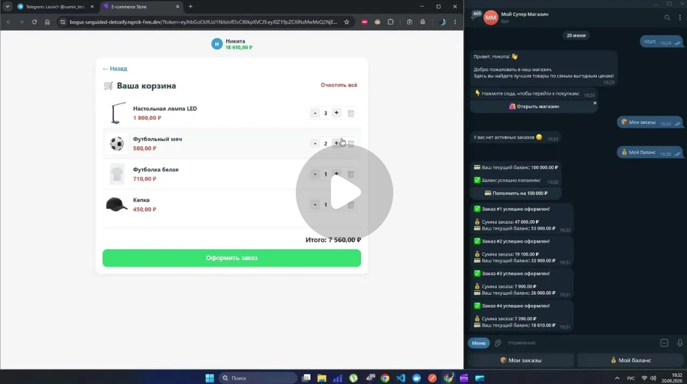

# 🛍️ Telegram-Integrated E-commerce Store (Fullstack)


Полноценный независимый интернет-магазин с бесшовной интеграцией Telegram. Проект работает в любом внешнем браузере, используя Telegram-бота как единую точку входа (Magic Links), личный кабинет и систему уведомлений.

## 🎥 Демонстрация работы

[](https://disk.yandex.ru/i/zgEWbManDjBGCA)

[](https://vimeo.com/1203063732)

## ✨ Ключевые особенности архитектуры

- **Безопасность (Magic Links & JWT):** Аутентификация реализована без классических логинов/паролей. Telegram-бот генерирует криптографически подписанный JWT-токен (`HS256`). При переходе по ссылке из бота Frontend читает токен, а Backend верифицирует его, что защищает API от подделки ID в открытом интернете.
- **Изоляция и Nginx Reverse Proxy:** Frontend и Backend полностью разделены, но работают на одном порту благодаря Nginx, что решает проблемы с CORS.
- **Реактивность:** Реализован механизм Short Polling для моментального обновления интерфейса (например, изменение статуса при отмене заказа через бота).
- **База данных (3НФ):** PostgreSQL спроектирована в Третьей Нормальной Форме. Реализована фиксация цены товара на момент покупки (`price_at_purchase`), защищающая бухгалтерию от будущих изменений цен в каталоге.
- **Database Seeding:** Автоматическое наполнение БД стартовыми товарами при первом запуске контейнера (`products.json`).

---

## 🛠️ Стек технологий

- **Frontend:** React.js, Vite
- **Backend:** Python 3.13, FastAPI, SQLAlchemy (Async), PyJWT
- **Bot:** aiogram 3.x (Async Telegram Bot API)
- **Database:** PostgreSQL + asyncpg
- **DevOps:** Docker, Docker Compose, Nginx

---

## 🚀 Инструкция по локальному запуску

Проект полностью контейнеризирован. Для запуска вам потребуется только **Docker**.

### 1. Клонирование репозитория

```bash
git clone https://github.com/ВАШ_НИК/tg-shop-webapp.git
cd tg-shop-webapp
```

---

### 2. Настройка окружения

В корне проекта создайте файл `.env` и добавьте в него следующие переменные:

```env
# Ваш токен бота (получить у @BotFather)
BOT_TOKEN=123456789:ABCdefGHIjklmNOPqrsTUVwxyz

# Строка подключения к БД (для Docker-контейнера)
DATABASE_URL=postgresql+asyncpg://shop_user:super_secret_password@db:5432/shop_db

# Секреты для БД
POSTGRES_USER=shop_user
POSTGRES_PASSWORD=super_secret_password
POSTGRES_DB=shop_db

# Сумма тестового пополнения баланса
TOPUP_AMOUNT=100000

# Публичный URL вашего фронтенда
WEBAPP_URL=https://ваша-ссылка.ngrok-free.app
```

---

### 3. Запуск контейнеров

Запустите сборку и старт сервисов одной командой:

```bash
docker-compose up -d --build
```

_После этого Frontend будет доступен на `http://localhost:80`, а Backend на `http://localhost:80/api`._

---

### 4. Настройка проброса портов (для работы с Telegram)

Так как Telegram требует `https`, необходимо пробросить 80-й порт локальной машины в интернет. Вы можете использовать `ngrok`:

```bash
ngrok http 80 --domain=ваша-ссылка.ngrok-free.app
```

Впишите полученную ссылку в файл `.env` в переменную `WEBAPP_URL` и перезапустите контейнер бота:

```bash
docker-compose restart bot
```

---

**Разработчик:** Никита Сумин

**Контакты:** Telegram: @NikitaSumin29 | Email: n.sumin73@gmail.com
